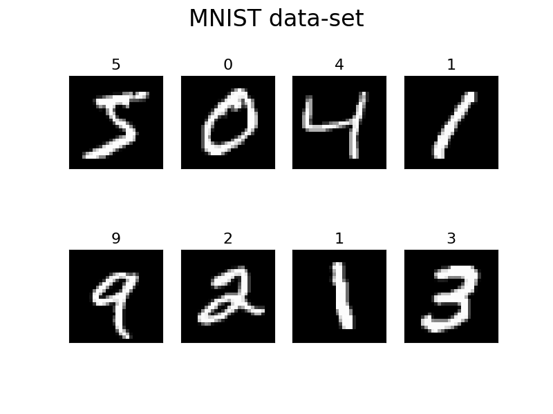

MNIST image classification
=============================
Welcome to the MNIST image classification!

On this page, we classify the MNIST image which is a handwritten number.
The dataset has 60000 train images and 10000 test images.

This problem's goal is a classification of the number from the image.

Prepare data
~~~~~~~~~~~~~
1. Load data

   We prepared the MNIST dataset as Marquetry's built-in dataset. Let's load the data!

   .. code-block:: python

      import marquetry as mq
      from marquetry.transformers import Compose, ToFloat, Normalize

      dataset = mq.datasets.MNIST(train=True, transform=Compose([ToFloat(), Normalize(0., 255.)]))
      test_dataset = mq.datasets.MNIST(train=False, transform=Compose([ToFloat(), Normalize(0., 255.)]))

      print(dataset.source_shape)
      print(test_dataset.source_shape)
      >>> (60000, 1, 28, 28)
      >>> (10000, 1, 28, 28)

   The shape means (number of images, channels, height, width).

   .. tip::
      ``channels`` means the color channel in the image.
      Probably, you've heard of ``RGB`` or ``CMYK``.

      ``RGB`` means ``Red`` and ``Green`` and ``Blue`` so if you have ``RGB`` image,
      the image has 3 channels.

      Each channel has a heat map of the corresponding color and it can express the matrix which
      has 0 to 255 values on the same size of the image.

      Let's check the channels.
      The original image is the one.

      .. image:: ../../_static/img/tabby_image.png
         :align: center

      Very cute cat..., I love cats.

      Oh, it doesn't matter.
      Let's check the color map. This photo has RGB channels. So, the below are separate channels.

      .. grid:: 3
         :gutter: 2

         .. grid-item::

            .. image:: ../../_static/img/red_tabby.png

            Red channel

         .. grid-item::

            .. image:: ../../_static/img/green_tabby.png

            Green channel

         .. grid-item::

            .. image:: ../../_static/img/blue_tabby.png

            Blue channel

      The original image is created by piling these 3 color channels.

      If the channel is only 1, the image is often treated as a Gray Scale image.
      Even if Grayscale image, the array is the same.

      In the Gray scale, 0 is black and 255 is white. Also, the MNIST is 1 channel image so this is
      Grayscale.

   And the target data is the label of the handwritten number.

   The ``transform`` is a transform function when getting items from the dataset.
   ``Compose`` is the wrapper. ``ToFloat()`` works as the transformer from int or any float to 32-bit float.
   And, ``Normalize()`` works as the transformer from raw value to scaled value in the range of 0 to 1.

2. Load dataset to dataloader

   DataLoader helps the mini-batch data creation on your behalf.
   In this time, the ``batch_size`` is 32.

   .. code-block:: python

      batch_size = 32
      shuffle = True

      dataloader = mq.dataloaders.DataLoader(dataset, batch_size=batch_size, shuffle=shuffle)
      test_dataloader = mq.dataloaders.DataLoader(test_dataset, batch_size=batch_size, shuffle=False)

.. centered:: Then you complete preparation. Congratulation!!

Prepare model
~~~~~~~~~~~~~~

1. Create a model

   In this time, we use :class:`marquetry.models.CNN` which has the below layers.

   1st layer:
      ``Convolution`` layer has ``32`` filters which size is ``(3, 3)`` and
      the stride is ``1`` and padding is ``0``.
      With ``ReLU`` as an activation function.

   2nd layer:
      ``Convolution`` layer has ``64`` filters which size is ``(3, 3)`` and
      the stride is ``1`` and padding is ``0``.
      With ``ReLU`` as an activation function.

   3rd layer:
      ``Max Pooling`` layer which down sample the matrix using ``(2, 2)`` size kernel and stride ``2``.

   4th layer:
      ``Dropout`` layer which drop ``0.25`` ratio neurons(values).
      With ``flatten`` the tensor to matrix
      (the original data has 3-dims but the fnn layer can't treat the data so it needs to be flattened.)

   5th layer:
      ``Fully-connected(Linear)`` Layer which has ``512`` neurons with ``ReLU`` as activation function.

   6th layer:
      ``Dropout`` layer which drop ``0.5`` ratio neurons(values).

   7th layer:
      ``Fully-connected(Linear)`` Layer which is the output layer.
      The layer has ``output size`` neurons.

   The MNIST dataset has 10 labels(0 to 9 handwritten number). So the ``out_size`` should be ``10``.

   .. code-block:: python

      model = mq.models.CNN(out_size=10, activation=mq.functions.relu)

2. Set the model to Optimizer

   We use :class:`marquetry.optimizers.Adam` as optimizer.

   .. code-block:: python

      optim = mq.optimizers.Adam()
      optim.prepare(model)

.. centered:: Now you have all you need to learn the MNIST dataset! Let's proceed to the learning section!

Model fitting
~~~~~~~~~~~~~~

In this time, the ``max_epoch`` is 25, and ``accuracy`` and ``loss`` are used as accuracy indicators.

.. caution::
   In this step, CNN needs a very long time(a couple hours unit range time).

   Therefore, if you try to this fitting on your local environment, we suggest using
   the CUDA accelerator.
   For using it, :mod:`cupy` must be needed.

   Optional: Reload the dataset using the CuPy array.

   .. code-block:: python

      dataloader = mq.dataloaders.DataLoader(dataset, batch_size=batch_size, shuffle=shuffle, cuda=True)
      test_dataloader = mq.dataloaders.DataLoader(test_dataset, batch_size=batch_size, shuffle=False, cuda=True)

   Specify the ``cuda`` as True, the dataset will be loaded as :class:`cupy.ndarray`.

.. code-block:: python

   max_epoch = 25

   for epoch in range(max_epoch):
       sum_acc, sum_loss = 0, 0
       iterations = 0

       for data, label in dataloader:
           iterations += 1

           y = model(data)
           loss = mq.functions.classification_cross_entropy(y, label)

           acc = mq.functions.evaluation.accuracy(y, label)

           model.clear_grads()
           loss.backward()
           optim.update()

           sum_loss += float(loss.data)
           sum_acc += float(acc.data)

       print("{} / {} epoch | loss: {:.4f} | accuracy: {:.4f}"
             .format(epoch + 1, max_epoch, sum_loss / iterations, sum_acc / iterations))

   test_acc, test_loss = 0, 0
   iterations = 0

   with mq.test_mode():
       for data, label in test_dataloader:
           iterations += 1

           y = model(data)

           test_loss += float(mq.functions.classification_cross_entropy(y, label).data)
           test_acc += float(mq.functions.evaluation.accuracy(y, label).data)

   print("Test data | loss: {:.4f} | accuracy: {:.4f}".format(test_loss / iterations, test_acc / iterations))

The result is

.. code-block::

   1 / 25 epoch | loss: 0.1381 | accuracy: 0.9580
   2 / 25 epoch | loss: 0.0564 | accuracy: 0.9828
   3 / 25 epoch | loss: 0.0403 | accuracy: 0.9877
   ...
   25 / 25 epoch | loss: 0.0075 | accuracy: 0.9980

   Test data | loss: 0.0466 | accuracy: 0.9926

.. note::
   If you don't have a CUDA environment and the training is difficult, you can use pre-trained parameters.

   Please download the pre-trained params file:
   :download:`Pre-trained MNIST(Click this!) <../../_static/file/mnist_model_cnn.npz>`

   You can use this file like...

   .. code-block:: python

      model = mq.models.CNN(out_size=10, activation=mq.functions.relu)

      model.load_params("/path/to/params/file")

      test_acc, test_loss = 0, 0
      iterations = 0

      with mq.test_mode():
          for data, label in test_dataloader:
              iterations += 1

              y = model(data)

              test_loss += float(mq.functions.classification_cross_entropy(y, label).data)
              test_acc += float(mq.functions.evaluation.accuracy(y, label).data)

      print("Test data | loss: {:.4f} | accuracy: {:.4f}".format(test_loss / iterations, test_acc / iterations))

   This params file optimized the :class:`marquetry.models.CNN` with :meth:`marquetry.functions.relu`
   as an activation function.

   If you use other construction CNN, the params from the file can't indicate the high recognition power.

The model can classify the handwritten number with 99.26% accuracy.
This accuracy isn't bad.

Let's try it as a challenge yourself to reach 99.5%!

.. tip::
   To realize the accuracy, the hyperparameter turning is very important.

   - How many Convolution layers are put on the model?
   - How many Filters in the convolution layer should be put on the layer?
   - How much data should be in one batch? (``Batch Size``)
   - What activation function should we use?
   - How many epochs should we use?
   - What optimizer should we use?

   ...

   There are many hyperparameters in Deep Learning, so please create your own model
   using :class:`marquetry.Model` base class.

   If you want to check how to build your own model, please reference the :class:`marquetry.models.CNN`
   source code. (`CNN <https://github.com/little-tabby/Marquetry/blob/main/marquetry/models/cnn/cnn.py>`_)

   It is not difficult, when you want to build a model, you should do only the below 2 steps.

   1. Prepare the layer using in the model on the model class constructor.
   2. Chain the layer using the output as the next layer input.

   For example, we want to create a SimpleFNN model which has 1 hidden layer(128 neurons) and an output layer,
   and activation is ReLU, then we should do like the below.

   .. code-block:: python

      import marquetry as mq

      class SimpleFNN(mq.Model):
          def __init__(self, out_size):

             self.linear1 = mq.layers.Linear(128)
             self.linear2 = mq.layers.Linear(out_size)

             self.activation = mq.functions.relu

          def forward(self, x):
              y = self.linear1(x)
              y = self.activation(y)
              output = self.linear2(y)

              return output

   Then this can be used the same way as the built-in models.

   When you train this model, we can call this model and chain it with a loss function.
   And calling the loss value ``backward`` method(each params gradient calculated by this)
   and then, model parameter update.

   When you create your own model using ``Marquetry``, the backward implementation doesn't need to be considered.
   Such complex processes are taken over by the ``Marquetry`` core.

In the last of this section, let's check what images are misclassified.

.. grid:: 3
   :gutter: 2

   .. grid-item::

      .. image:: ../../_static/img/wrong_2109.png

      .. centered:: 3

   .. grid-item::

      .. image:: ../../_static/img/wrong_3384.png

      .. centered:: 2

   .. grid-item::

      .. image:: ../../_static/img/wrong_3520.png

      .. centered:: 6

   .. grid-item::

      .. image:: ../../_static/img/wrong_5331.png

      .. centered:: 1

   .. grid-item::

      .. image:: ../../_static/img/wrong_7434.png

      .. centered:: 4

   .. grid-item::

      .. image:: ../../_static/img/wrong_9009.png

      .. centered:: 7

These numbers are difficult even from a human eye so the model can classify the data close to the human eye.

Of course, if you look for all the wrong images, there are some clear mistakes.
But the important thing is the CNN model can classify the handwritten number with 99.2% accuracy.

Maybe, the human eye can be more accurate than the model but this model can classify the 10000 data in just a few seconds.
If we classify these 10000 data by your hand, the work needs over a couple of hours.

Please note, that one of the largest benefits of using deep learning is the time reduction.
99.2% accurate in just a few seconds is more beneficial than 100% accurate over a couple of hours in almost cases.

Thank you for your hard work!! Now the CNN(Convolutional Neural Network) example lecture is completed!

CNN is used in a variety of use cases that use images. We prepare the FashionMNIST dataset as a test problem.
The FashionMNIST is a harder dataset than MNIST.

The data construction follows the original MNIST.
FashionMNIST was created to deal with the MNIST is too easy in current deep learning and
difficult to evaluate the model correctly.
You confirmed in this section, the MNIST can realize over 99% accuracy even with such simple CNN.
Current CNN can be over 100 layers so the original MNIST dataset isn't appropriate for such models.

FashionMNIST is more enjoyable if you are the kind that gets more fired up the harder something is.

After this, let's try the :class:`marquetry.datasets.FashionMNIST` using your original CNN and aim to reach over 90%!

----

Do you want to check more examples? Sure! We prepare more example using Marquetry.

Do you want to check Titanic prediction?:
   .. button-link:: ./titanic_disaster.html
      :color: info
      :outline:
      :expand:

      Titanic Disaster prediction

Would you like to check time-series data?:
   .. button-link:: ./sequential_data_rnn.html
      :color: info
      :outline:
      :expand:

      Trigonometric toy problem
