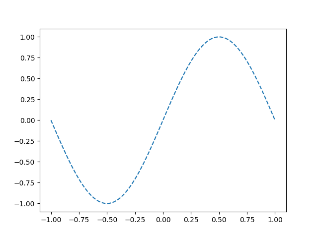
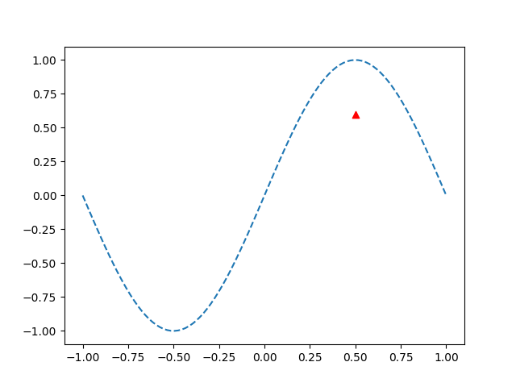
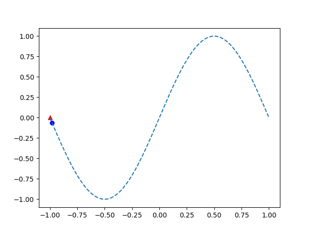
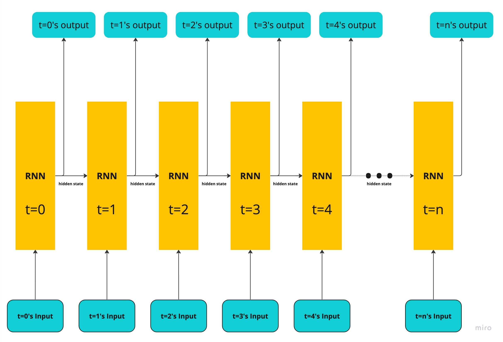
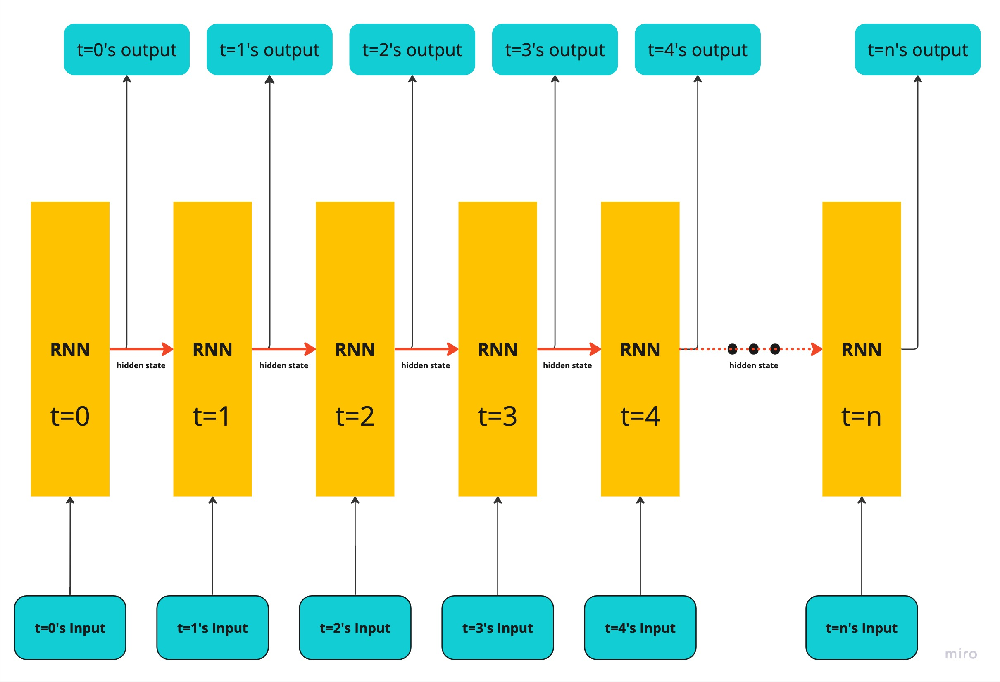
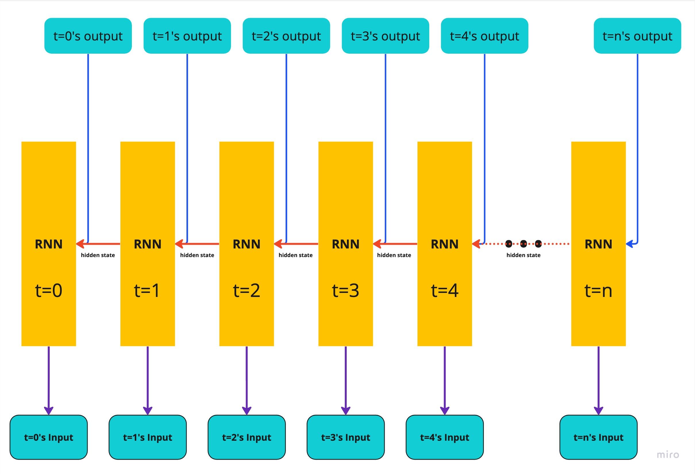
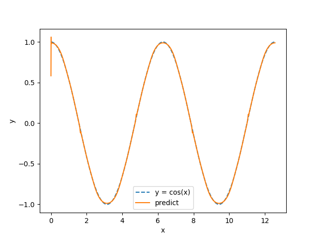
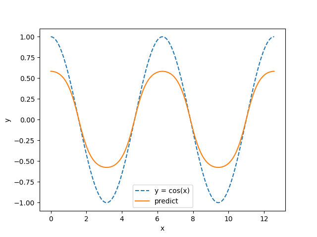

Trigonometric curve prediction
===============================
Welcome to the Trigonometric curve sequential prediction!

In this page, we predict the Trigonometric curve.
Hmm...Oh, Do you want to know what is different from
`the separate area over/under Sin Curve problem <../get_started_components/entrance.html>`_ ?

Sure! In the area separation problem, the actual problem is which area should each coordinate be assigned.
This problem can consider only 1 coordinate because the each coordinates are independent with others.

So how about this problem?
This sequential problem predicts next value receiving the one-past value as input data.

Let's check the difference using Sin values.

.. code-block:: python

   import numpy as np
   import matplotlib.pyplot as plt

   x = np.linspace(-1, 1, 100)
   y = np.sin(x * np.pi)

   plt.plot(x, y, linestyle="dashed")
   plt.show()

For the area separation problem, if there is (x, y) = (0.5, 0.6) coordinate, which area should this belong to?

.. code-block:: python

   plt.plot(x, y, linestyle="dashed")
   plt.scatter(0.5, 0.6, marker="^", c="r")
   plt.show()

From this, the coordinate is belong to the under area.
Then if we get new coordinate (0.3, 0.9), the area does **NOT** relate to the (0.5, 0.6) coordinate.
(There is no relation between (0.3, 0.9)'s belong area and (0.5, 0.6)'s belong area.
These area depends only the over or under SinCurve line.)

Then, the sequential problem, the input data and the correct data are the sin curve y axis coordinate.
(x axis values are considered as time-series. (the index `1` is the next of the index `0`,
and the index `2` is the next of the index `1`...))

If there is a first index coordinate, the problem asks what is the next coordinate(y axis value)?

.. code-block:: python

   plt.plot(x, y, linestyle="dashed")
   plt.scatter(x[0], y[0], marker="^", c="r")
   plt.scatter(x[1], y[1], marker="o", c="b")
   plt.show()

In this problem, we have the red triangle y-axis value(``-1.22464680e-16``),
and we predict the next y-axis value which is the blue circle.

Like I said, the x-axis is considered as time-series so this problem's core problem is that
predict the next value from the past values.

In other words, predictor receives the time ``t``'s y and predicts ``t+1``'s y.

In such problem, we use ``RNN (Recurrent Neural Network)``.
RNN is store special value, which called as ``hidden state``, this is very, very important for RNN.
RNN can capture the time-series trends by the ``hidden state``.

This state store all past information, so RNN can use the input and the past information to predict the next future.

.. tip::

   :You: What is ``hidden state``? You said the state stores the past information. But I can't imagine it really.
   :Me: Okey, let's check the ``hidden state`` mechanisms!

   RNN model having wights of input transform and hidden transform, it calculates the below flow.

   1. Initialize all parameters

      - Initialize weights randomly (``input weights`` and ``hidden weights``)
      - Initialize ``bias`` if you use bias by only `0` matrix
      - Initialize ``hidden state`` by only `0` matrix (``hidden state`` shape is the same as the output shape)

   2. Input the input data

      - Linear transformation with the ``input weights`` and ``bias`` like as the fully-connected neural network.

   3. Linear transform hidden state with ``hidden weights``

      .. note::
         At the first step(t=0), the hidden state filled by only `0` so this result is also 0.

   4. Sum up the 2's output data and 3's output

      .. note::
         At the first step(t=0), 3's output is 0 so the sum is the same as 2's output.

   5. Scale the 4's output using :meth:`marquetry.functions.tanh`

      .. note::
         Of course, we can use other activation function at this step, but in RNN,
         Tanh is often used as activation function.

   6. Output the 5's output as the result, and it store as the next time hidden state too.

   Therefore, the RNN can be expressed as the below image flow.

   .. image:: ../../_static/img/RNN.jpg
      :align: center
      :width: 70%

   Please focus the step 4, the output is the sum of the input and **the hidden state** information.
   After that, in the step 6, the data store as the next time hidden state.

   From the specification, RNN can expand time-series axis like the below.

   .. image:: ../../_static/img/RNN_expand.jpg
      :align: center
      :width: 70%

   ...You already know the answer. What is the ``hidden state``?

   ``hidden state`` is the encoded past all accumration information.

   (Linear and activation transed data can't be understood by human so such data is sometimes called ``encoded data``.)

Prepare data
~~~~~~~~~~~~~
1. Load data

   We prepared Trigonometric data as Marquetry built-in dataset. Let's load the data!

   .. code-block:: python

      import marquetry as mq

      dataset = mq.datasets.TrigonometricCurve(train=True)

      print(dataset.source_shape)
      >>> (4999, 1)

      test_dataset = mq.datasets.TrigonometricCurve(train=False)

      print(test_dataset.source_shape)
      >>> (4999, 1)

   :class:`marquetry.datasets.TrigonometricCurve` returns Sin(training data) or Cos(test data) values.
   Tell you the truth, the train data(Sin) is not truly Sin Curve, the train data is mixed with little bit noises.

   Let's check the ``dataset`` and ``test_dataset`` plotting to fig!

   .. code-block:: python

      import numpy as np
      import matplotlib.pyplot as plt

      x = np.linspace(0, 3 * np.pi, len(dataset))

      plt.plot(x, dataset.source)
      plt.plot(x, test_dataset.source, linestyle="dashed")

      plt.show()

   .. image:: ../../_static/img/trigonometric_plot.png
      :align: center

   The blue line is ``dataset`` (train data). You can see the line shaky.

   :You: Why does you add the noise to the sin curve?
   :Me: To train a robust model. If you use no noise data as training data,
        The model tends to overfit the data.
        And also almost real data has noise a greater or lesser degree. If only clean data is used as training data,
        the model can be driven by noise heavily.
        To add noise the training data, the data can reduce such issues.

        .. tip::
           As a matter of fact, such adding noise can be also used as a purpose of the extending data.
           In this dataset, there isn't such purpose(not extended) but if you face the training data is very small
           and can't gather anymore, you may countermeasure the situation by this method.

           ★ Noise extending can be not always used in any data, this is just one of the extending method.

2. Load dataset to dataloader

   For sequential dataset, we use :class:`marquetry.dataloaders.SeqDataLoader` as dataloader.
   This dataloader was designed as special to the sequential data.
   The speciality is the batch select method. In sequential data, we need to ensure the sequence data size
   from the sequential data's specification.

   In the SeqDataLoader, the sequence size is calculated by the data size and the batch size automatically.
   And, the dataloader provides appropriate mini-batch dataset.

   In this time, the batch_size is set as 32.

   .. code-block:: python

      batch_size = 32

      dataloader = mq.dataloaders.SeqDataLoader(dataset, batch_size=batch_size)
      test_dataloader = mq.dataloaders.SeqDataLoader(test_dataset, batch_size=batch_size)

.. centered:: Then you complete preparation. Congratulation!!

Prepare model
~~~~~~~~~~~~~~

1. Create model

   In this time, we use :class:`marquetry.layers.RNN` and :class:`marquetry.layers.Linear` to create model.
   Firstly, define the model class, and then you get the instance with the ``out_size`` is `1`.

   .. code-block:: python

      class SimpleRNN(mq.Model):
          def __init__(self, out_size, hidden_size=128):
              super().__init__()

              self.rnn = mq.layers.RNN(hidden_size)
              self.linear = mq.layers.Linear(out_size)

          def reset_state(self):
              self.rnn.reset_state()

          def forward(self, x):
              y = self.rnn(x)
              y = self.linear(y)

              return y

      model = SimpleRNN(out_size=1)

2. Set the model to Optimizer

   We use :class:`marquetry.optimizers.Adam` as optimizer.

   .. code-block:: python

      optim = mq.optimizers.Adam()
      optim.prepare(model)

.. centered:: Now you have all you needed to learn the Trigonometric Sequential Curve dataset!
.. centered:: Let's proceed the learning section!

Model fitting
~~~~~~~~~~~~~~

For the RNN, we need to set new hyper parameter which is called as ``bptt_length``.
``BPTT`` means ``Back-propagation Through Time``, so the ``bptt_length`` indicates
"How long is the links from the past kept?".

Please re-view the below image.

The real neural network link is the flow from the bottom to the top.

This link is the same as the normal neural network. Already you know.

However, only these links, the model can't learn the time-series trends.
Do you remember there are one another direction links in RNN image?

...Yes, the time direction links, surely this links are logical link, not real link.
However, this link is very important to get the trends of time-series, isn't it?

We need to also consider this link in backpropagation.
In other words, RNN has 2 direction neural network. One is the normal network on the 1 time.
The other is the time-series direction network.

Therefore, the backpropagation should be the below image.

Well, from these, the training preparation seems to be complete.
Maybe you think "Anyhow, such backpropagation is also managed by Marquetry, right?".

Yes, your thinking is correct but for the time-series direction, if the network links to infinity,
the training can't proceed correctly.

The cause is very simple, such very long link causes vanishing gradient due to the computational
graph is very complex. (In general, gradient is weaken as the computation graph is longer.)

.. tip::
   Gradient Vanishing is one of the most important problem in deep learning.
   In the past, this problem is serious for a normal deep learning network.

   At the time, sigmoid function is often used as activation function.
   However, sigmoid function's gradient can be 0.25 even it is max.
   So as the network gets deeper, the gradient gets weaker, and the gradient is vanishing at final.

   Why is ReLU often used as activation function currently?
   The answer is that ReLU is less likely to cause gradient vanishing problem.
   (More accurate, ReLU needs less computation cost so this is also one of the largest reason.)

.. topic:: What is **Computational Graph**?

   ``Computational Graph`` is the thing which visualize the computation process.

   Computational Graph is constructed by some nodes which are simple computation unit like add or div or so.
   This is very helpful to compute gradient because it can just going back like backpropagation.

   In other words, ``Computational Graph`` is the thing which visualize differentiation chain rule.

   Dynamic computational graph frameworks including Marquetry are using this mechanisms
   in the computation core algorithms.

   In the below image, I've try to compute sigmoid function differentiation.

   .. image:: ../../_static/img/computation_graph.jpg
      :align: center

   ``Computational Graph``'s one of the most important advantage is
   we can compute the differentiation just going back the graph when the computational graph draw down once.

To prevent such vanishing gradient problem for time-series axis network, we truncate the network link certain length.
The length needs to be set as appropriate length for the data.

From this, the network can learn time-series trends correctly by propagated correct gradient.

This length is the ``bptt_length``. This is important when you use RNN, if you can't learn data correctly,
try to reduce the keeping time-series length.

.. tip::
   In the real world problem, RNN can't show enough ability due to the too short truncation.

   ``LSTM`` (Long-Short Term Memory) was invented to learn more long dependencies.
   In ``LSTM``, it store a special value different from hidden state, which is called ``Memory Cell``,
   as the value's benefit, ``LSTM`` can learn more long term time-series dependencies than normal RNN.

   Till some years ago, ``LSTM`` is the front line of the natural language process.
   ``Seq2Seq`` which extend model of the ``LSTM`` was used as a main stream of AI chat bot.

   Recently, the position of the general chatbot main stream are depriving by ``transformer``,
   but it is used some specify tasks still front line.

   This shows ``LSTM`` is how versatile it is.

Then, let's try to learn the curve!

In this time, the ``max_epoch`` is ``25`` and the ``bptt_length`` is ``32``,
and ``loss`` are used as accuracy indicator.
(This problem predict the next **value** so this is **Regression** problem. Thus, the ``accuracy`` can't be used.)

.. code-block:: python

   max_epoch = 25
   bptt_length = 32
   seq_len = len(dataset)

   for epoch in range(max_epoch):
       loss = mq.array(0)
       sum_loss = 0
       count = 0

       for data, correct in dataloader:
           y = model(data)
           loss += mq.functions.mean_squared_error(y, correct)
           count += 1

           if count % bptt_length == 0 or count == seq_len:
               model.clear_grads()
               loss.backward()
               loss.unchain_backward()
               optim.update()

               sum_loss = float(loss.data)
               loss = mq.array(0)

       print("{} / {} epoch | loss: {:.4f}".format(epoch + 1, max_epoch, sum_loss / count))

   test_loss = 0
   count = 0
   model.reset_state()

   with mq.test_mode():
       for data, correct in test_dataloader:
           count += 1

           y = model(data)

           test_loss += float(mq.functions.mean_squared_error(y, correct).data)

   print("Test data | loss: {:.4f} ".format(test_loss / count))

The result is

.. code-block::

   1 / 25 epoch | loss: 0.0156
   2 / 25 epoch | loss: 0.0111
   3 / 25 epoch | loss: 0.0037
   ...
   25 / 25 epoch | loss: 0.0002

   Test data | loss: 0.0008

From the loss, the learning seems to proceed correctly. However, we can't check it directly by these.

Then, let's check the model using plotting.

.. code-block:: python

   model.reset_state()
   time = np.linspace(0, 4 * np.pi, 5000)
   cos_data = np.cos(time)

   predict_list = []

   with mq.test_mode():

       for x in cos_data:
           x = np.array(x).reshape(1, 1)
           y = model(x)
           predict_list.append(float(y.data[0, 0]))

   plt.plot(time, cos_data, label="y = cos(x)", linestyle="dashed")
   plt.plot(time, predict_list, label="predict")
   plt.xlabel("x")
   plt.ylabel("y")
   plt.legend()
   plt.show()

The model looks good!
Predict trajectory can trace the actual cos curve!

:You: I think this trajectory can be predicted without hidden state. Is it really necessary?
:Me: Hmm, ok, let's check prediction without hidden state!

.. code-block:: python

   time = np.linspace(0, 4 * np.pi, 5000)
   cos_data = np.cos(time)

   predict_list = []

   with mq.test_mode():

       for x in cos_data:
           model.reset_state() # reset hidden state
           x = np.array(x).reshape(1, 1)
           y = model(x)
           predict_list.append(float(y.data[0, 0]))

   plt.plot(time, cos_data, label="y = cos(x)", linestyle="dashed")
   plt.plot(time, predict_list, label="predict")
   plt.xlabel("x")
   plt.ylabel("y")
   plt.legend()
   plt.show()

From this, the hidden state is important to trace the trajectory as more accurate!

Thank you for your hard work!! Now the RNN(Recurrent Neural Network) example lecture is completed!

RNN(and LSTM) is used wide-variety use cases needing to consider time-series like natural language process.

Recently, AI chatbot like ChatGPT(from OpenAI) and Bard(from Google) and so becomes explosion famous.
These model is using ``Transformer`` which uses Attention mechanism, different from RNN.
However, such chatbot history started from RNN.

And, ``Attention`` was used with ``RNN(LSTM)``.
To learn the ``RNN`` and ``LSTM`` may help you if you want to learn and create AI chatbot.

And also, generate music or generate movie, machine translation use RNN(LSTM).

Let's keep to try deep learning! Thank you!!

----

Do you want to check more example? Sure! We prepare more example using Marquetry.

Do you want to check Titanic prediction?:
   .. button-link:: ./titanic_disaster.html
      :color: info
      :outline:
      :expand:

      Titanic Disaster prediction

Do you want to check image classification?:
   .. button-link:: ./mnist_cnn.html
      :color: info
      :outline:
      :expand:

      MNIST classification