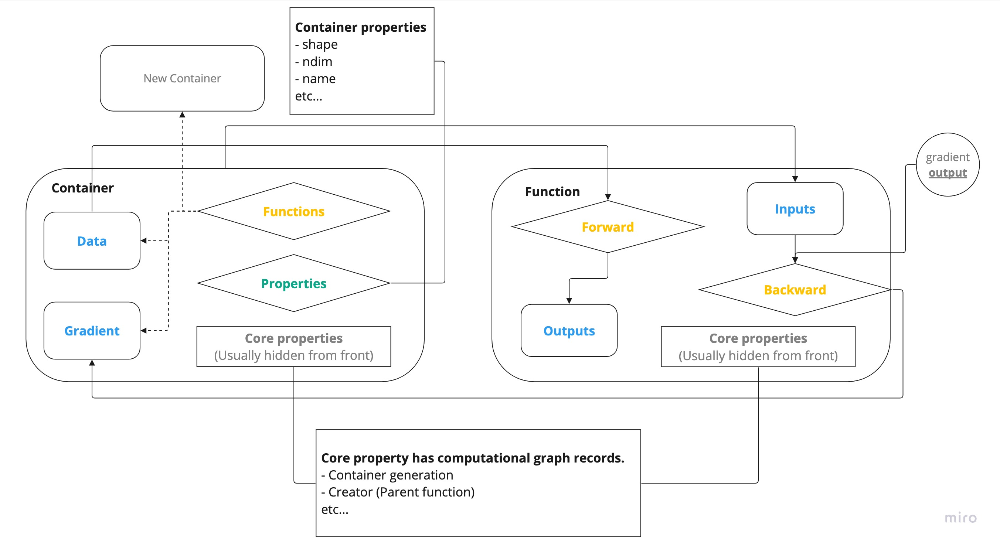

.. marquetry documentation master file, created by
   sphinx-quickstart on Sun Sep 10 01:19:44 2023.
   You can adapt this file completely to your liking, but it should at least
   contain the root `toctree` directive.

Welcome to Marquetry |version|!
=====================================

Marquetry
~~~~~~~~~~
Marquetry is developed by only Python!
If you want to see the source code, let's see `GitHub <https://github.com/little-tabby/Marquetry>`_!

The source code can read easy if you are familiar with Python.

Our purpose is create Deep Learning framework focus on the ``education``
so complex implementation is minimized as much as possible.

After learning the basic, anyone can learn the mechanism of framework from the source code.

For the simple implementation, there are some inefficient algorithms.

Therefore if you are a professional, sorry...this can't your needs..., please consider to use other framework.
(I suggest to use `PyTorch <https://pytorch.org/>`_.)

If you are beginner of deep learning or deep learning learner, this framework always besides of you!

Logical construction
~~~~~~~~~~~~~~~~~~~~~
Marquetry core construction is the below.

Marquetry's core components are :class:`Container` and :class:`Function`.

Container has ``data`` and ``gradient`` which is actual values. So Container seems like a box of the values.
Function applies the function to the ``Container``, and returns the new ``Container`` which has ``data`` from the
``Function`` outputs.

Please note, Marquetry is a dynamic computational graph framework so the ``Container`` records the passed functions
in the forward process, and it will gone back in the ``backward`` process.
In the backward, the backward function return the gradient, and it stored in the ``Container``'s gradient.

In generally, the model parameters is stored :class:`Parameter` which inherit the ``Container`` completely.
(In short, ``Parameter`` has the same methods as ``Container``.)

More information
~~~~~~~~~~~~~~~~~

.. toctree::
   :maxdepth: 1
   :caption: Contents:
   :hidden:

   documents/get_started
   documents/examples
   api_reference
   release_note

.. grid:: 2
   :gutter: 2

   .. grid-item-card:: Get Started!
      :link: documents/get_started
      :link-type: doc

      Let's start your journey!

   .. grid-item-card:: Examples using Marquetry
      :link: documents/examples
      :link-type: doc

      Let's see the example using Marquetry

.. grid:: 1

   .. grid-item-card:: API Reference
      :link: api_reference
      :link-type: doc

      All you needed is here!

